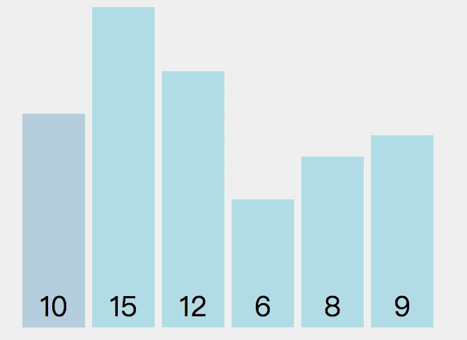

# study algorithm

### 最基本的算法O(n^2)
> 必须理解 编码简单，易于实现，是一些简单情景的首选。在一些特殊情况下，简单的排序算法更有效。简单的排序算法思想衍生出复杂的排序算法作为子过程，改进更复杂的排序算法。

### O(nlogn) 是最优排序算法
插入排序在对几乎已经排好序的数据操作时，效率高，即可以达到线性排序的效率。
但插入排序一般来说是低效的，因为插入排序每次只能将数据移动一位。
## 选择排序
**算法复杂度为O(n^2)**
> 选择排序原理如下：遍历数组，设置最小值的索引为0，比较1..length-1为止的所有元素大小，若arr[min] > arr[索引值] 则设置最小值索引为当前索引值，直接遍历结束为止，若最小值索引改变，则交换对应值。

{:height="300"}

## 插入排序
**算法复杂度O(n^2)**
> * 相比其他排序，插入排序可能并不需要完全遍历并交换数组子级，可提前break出循环。

> * 插入排序在对几乎已经排好序的数据操作时，效率高，即可以达到线性排序的效率。

> * 但插入排序一般来说是低效的，因为插入排序每次只能将数据移动一位。

## 希尔排序（插入排序的另一种）
